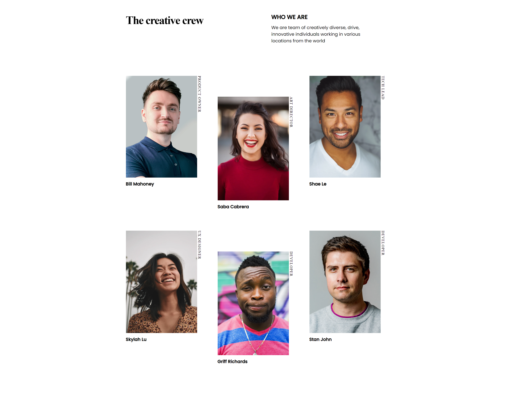

<!-- Please update value in the {}  -->

<h1 align="center">My Team Page Master</h1>

   Solution for a challenge from  <a href="http://devchallenges.io" target="_blank">Devchallenges.io</a>.

  <h3>
     | 
    <a href="https://{your-url-to-the-solution}">
      Solution
    </a>
     | 
    <a href="https://devchallenges.io/challenges/hhmesazsqgKXrTkYkt0U">
      Challenge
    </a>
  </h3>

<!-- TABLE OF CONTENTS -->

## Table of Contents

- [Overview](#overview)
- [Built With](#built-with)
- [Contact](#contact)
- [Acknowledgements](#acknowledgements)

<!-- OVERVIEW -->

## Overview

### Built With

- HTML
- CSS (Grid Layout)
- JavaScript

## Acknowledgements

- [Node.js](https://nodejs.org/)

## Contact

- LinkedIn 
- GitHub [@CamiloBeltran24](https://github.com/CamiloBeltran24)
- Twitter [@CamiloBeltran](https://twitter.com/CamiloBeltran)
